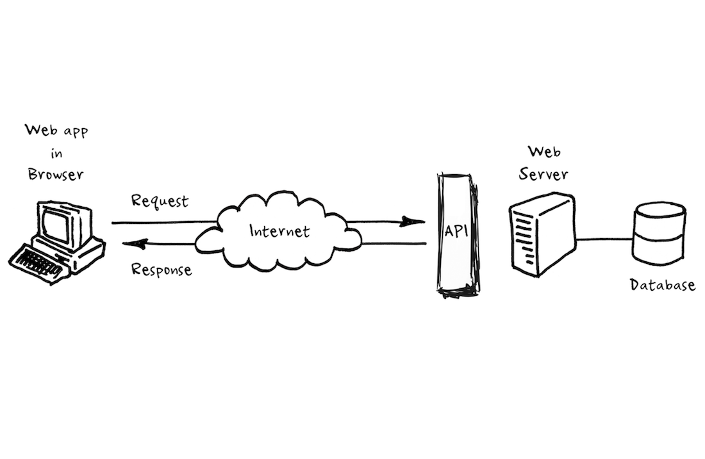
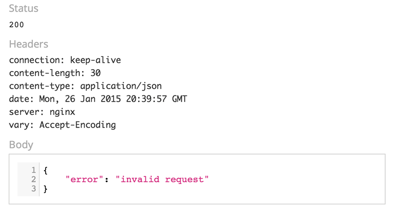

# API

### Application Programming Interface

In essence, an API acts as a communication layer, or as the name says an interface that allows different systems to talk to each other without having to understand exactly what each other does. 

**APIs** can come in many forms and shapes.

You usually make a ***request*** for information or data and the API return a ***response*** with what you requested.

There is 2 types of APIs:
1. Open APIs = accessible for public
2. Private APIs = unavailable for public

### API request

API calls are the medium by which they interact. An API call or ***request*** is a message sent to a server asking an API to provide a service or information

### API response

An response consists of the response body, headers and HTTP status code. 

Here a list of status codes:

